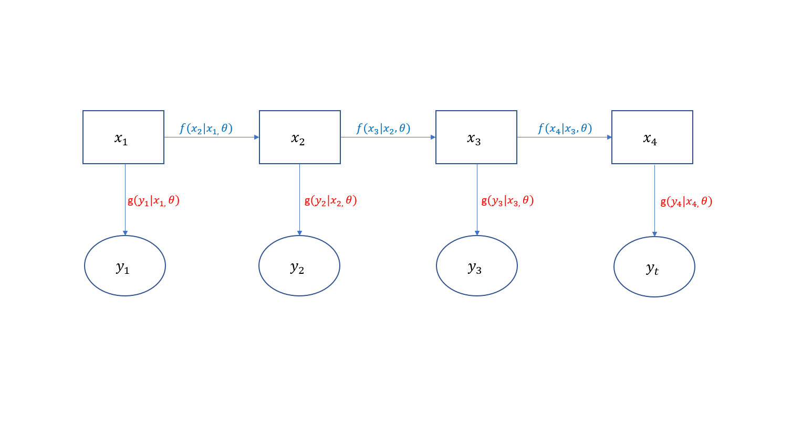

```{r setup, include = FALSE}
knitr::opts_chunk$set(#cache = FALSE, 
                      #echo = FALSE, 
                      #message = FALSE, 
                      #warning = FALSE,
                      #fig.height=6, 
                      #fig.width = 1.777777*6,
                      tidy = FALSE, 
                      comment = NA, 
                      highlight = TRUE, 
                      prompt = FALSE, 
                      crop = TRUE,
                      comment = ">",
                      collapse = TRUE)

library(rmarkdown)
library(knitr)
library(kableExtra)
library(xtable)
library(viridis)
library(rticles)
options(stringsAsFactors=FALSE)
knit_hooks$set(no.main = function(before, options, envir) {
    if (before) par(mar = c(4.1, 4.1, 1.1, 1.1))  # smaller margin on top
})
#knitr::opts_chunk$set(echo = FALSE)
knitr::opts_knit$set(width = 60)
source("my_knitter.R")
#library(tidyverse)
#library(reshape2)
#theme_set(theme_light(base_size = 16))
make_latex_decorator <- function(output, otherwise) {
  function() {
      if (knitr:::is_latex_output()) output else otherwise
  }
}
insert_pause <- make_latex_decorator(". . .", "\n")
insert_slide_break <- make_latex_decorator("----", "\n")
insert_inc_bullet <- make_latex_decorator("> *", "*")
insert_html_math <- make_latex_decorator("", "$$")
```
## Prerequisites 

## Prerequisites 
- Familiarity with the `R` programming language

## Prerequisites 
- Familiarity with the `R` programming language
- Rough understanding of Bayesian statistics and Likelihoods

## Prerequisites 
- Familiarity with the `R` programming language
- Rough understanding of Bayesian statistics and Likelihoods
- Exposure to `JAGS` and related MCMC packages

## Why State Space Models?

## Why State Space Models?
- The models that we use for physical processes are not perfect

```{r  out.width = "95%", echo = FALSE}
library(png)
library(knitr)
include_graphics('../graphics/rogue_wave.jpg') 
```
\vspace{.1cm}
\tiny Rogue waves, long thought to be sailor folklore, have been verified and have caused scientists to reconsider their theory behind waves
<!-- {width=80%} -->

## Why State Space Models?
- Ability to make inference on unobserved processes

```{r  out.width = "50%", echo = FALSE}
library(png)
library(knitr)
include_graphics('../graphics/MalariaMosquito.jpg') 
```
\vspace{.1cm}
\newline
\tiny Temperature is a common variable used as a proxy for Mosquito life traits


<!--  -->

## Why State Space Models?
- Physical processes are often non-linear and/or non-Gaussian

```{r  out.width = "100%", echo = FALSE}
library(png)
library(knitr)
include_graphics('../graphics/pop_growth.jpg') 
```
\vspace{.1cm}
\newline
\tiny Population growth is an example of a physical process that is typically non-linear and/or non-Gaussian

<!--  -->

## What is a State Space Model?

## What is a State Space Model?
- Broadly speaking, a state space model is when we have a process $x$ whose value at the current time point only depends on where it was at the last timepoint
    - $x_{t} \sim x_{t-1}$

## What is a State Space Model?
- Broadly speaking, a state space model is when we have a process $x$ whose value at the current time point only depends on where it was at the last timepoint
    - $x_{t} \sim x_{t-1}$
- $x$ is not observed, instead we observe $y$ which is related to $x$
    - $y_t \sim x_t$

## What is a State Space Model?
- Broadly speaking, a state space model is when we have a process $x$ whose value at the current time point only depends on where it was at the last timepoint
    - $x_{t} \sim x_{t-1}$
- $x$ is not observed, instead we observe $y$ which is related to $x$
    - $y_t \sim x_t$
- $y_{1:T}$ are independent of one another conditional on $x_{1:T}$

## What is a State Space Model?

## What is a State Space Model?

In general, state space models will have the form: \vspace{.1cm}

\begin{center}
$\begin{aligned}
&x_t = f(x_{t-1} | \Theta) \\
&y_t = g(x_t | \Theta)
\end{aligned}$
\end{center}

## What is a State Space Model?

In general, state space models will have the form: \vspace{.1cm}

\begin{center}
$\begin{aligned}
&x_t = f(x_{t-1} | \Theta) \\
&y_t = g(x_t | \Theta)
\end{aligned}$
\end{center}

- $f(x_t | x_{t-1}, \Theta)$ is called the _evolution function_

## What is a State Space Model?

In general, state space models will have the form: \vspace{.1cm}

\begin{center}
$\begin{aligned}
&x_t = f(x_{t-1} | \Theta) \\
&y_t = g(x_t | \Theta)
\end{aligned}$
\end{center}

- $f(x_t | x_{t-1}, \Theta)$ is called the _evolution function_
- $g(y_t | x_t, \Theta)$ is called the _observation density function_

## What is a State Space Model?

In general, state space models will have the form: \vspace{.1cm}

\begin{center}
$\begin{aligned}
&x_t = f(x_{t-1} | \Theta) \\
&y_t = g(x_t | \Theta)
\end{aligned}$
\end{center}

- $f(x_t | x_{t-1}, \Theta)$ is called the _evolution function_
- $g(y_t | x_t, \Theta)$ is called the _observation density function_
- $\Theta$ are the additional parameters that are used in $f(\cdot)$ and $g(\cdot)$

## What is a State Space Model?

In general, state space models will have the form: \vspace{.1cm}

\begin{center}
$\begin{aligned}
&x_t = f(x_{t-1} | \Theta) \\
&y_t = g(x_t | \Theta)
\end{aligned}$
\end{center}

- $f(x_t | x_{t-1}, \Theta)$ is called the _evolution function_
- $g(y_t | x_t, \Theta)$ is called the _observation density function_
- $\Theta$ are the additional parameters that are used in $f(\cdot)$ and $g(\cdot)$
- $f(\cdot)$ and $g(\cdot)$ are both stochastic

## Illustration
```{r  out.width = "100%", echo = FALSE}
library(png)
library(knitr)
 
```

## What Can We Use SSMs For? 

::: columns

:::: column
```{r  out.width = "100%", echo = FALSE}
library(png)
library(knitr)
include_graphics('../graphics/Browns_end_zone.0.jpg') 
```
```{r  out.width = "100%", echo = FALSE}
library(png)
library(knitr)
include_graphics('../graphics/chemprocc.jpg') 
```
::::

:::: column

```{r  out.width = "100%", echo = FALSE}
library(png)
library(knitr)
include_graphics('../graphics/forest.jpg') 
```
```{r  out.width = "100%", echo = FALSE}
library(png)
library(knitr)
 
```
::::

:::


## State Space Models: Example 1

## State Space Models: Example 1

Let's consider the following example, and identify the corresponding $\Theta, f(x_t | x_{t-1}, \Theta),$ and $g(y_t | x_t, \Theta)$. \vspace{.1cm}

\begin{center}
$\begin{aligned}
&x_t = x_{t-1} + \epsilon_{proc} \\
&y_t = x_{t} + \epsilon_{obs} \\
&\epsilon_{proc} \sim N(0, \phi), \epsilon_{obs} \sim N(0, \tau)
\end{aligned}$
\end{center}

## State Space Models: Example 1

Let's consider the following example, and identify the corresponding $\Theta, f(x_t | x_{t-1}, \Theta),$ and $g(y_t | x_t, \Theta)$. \vspace{.1cm}

\begin{center}
$\begin{aligned}
&x_t = x_{t-1} + \epsilon_{proc} \\
&y_t = x_{t} + \epsilon_{obs} \\
&\epsilon_{proc} \sim N(0, \phi), \epsilon_{obs} \sim N(0, \tau)
\end{aligned}$
\end{center}


- $\Theta = \{ \phi, \tau \}$

## State Space Models: Example 1

Let's consider the following example, and identify the corresponding $\Theta, f(x_t | x_{t-1}, \Theta),$ and $g(y_t | x_t, \Theta)$. \vspace{.1cm}

\begin{center}
$\begin{aligned}
&x_t = x_{t-1} + \epsilon_{proc} \\
&y_t = x_{t} + \epsilon_{obs} \\
&\epsilon_{proc} \sim N(0, \phi), \epsilon_{obs} \sim N(0, \tau)
\end{aligned}$
\end{center}

- $\Theta = \{ \phi, \tau \}$
- $f(x_t | x_{t-1}, \Theta) \sim N(\mu^* = x_{t-1}, \phi^* = \phi)$

## State Space Models: Example 1

Let's consider the following example, and identify the corresponding $\Theta, f(x_t | x_{t-1}, \Theta),$ and $g(y_t | x_t, \Theta)$. \vspace{.1cm}

\begin{center}
$\begin{aligned}
&x_t = x_{t-1} + \epsilon_{proc} \\
&y_t = x_{t} + \epsilon_{obs} \\
&\epsilon_{proc} \sim N(0, \phi), \epsilon_{obs} \sim N(0, \tau)
\end{aligned}$
\end{center}

- $\Theta = \{ \phi, \tau \}$
- $f(x_t | x_{t-1}, \Theta) \sim N(\mu^* = x_{t-1}, \phi^* = \phi)$
- $g(y_t | x_t, \Theta) \sim N(\mu^* = x_t, \phi^* = \tau)$

## State Space Models: Example 1

Let's consider the following example, and identify the corresponding $\Theta, f(x_t | x_{t-1}, \Theta),$ and $g(y_t | x_t, \Theta)$. 

\begin{center}
$\begin{aligned}
&x_t = x_{t-1} + \epsilon_{proc} \\
&y_t = x_{t} + \epsilon_{obs} \\
&\epsilon_{proc} \sim N(0, \phi), \epsilon_{obs} \sim N(0, \tau)
\end{aligned}$
\end{center}

- $\Theta = \{ \phi, \tau \}$
- $f(x_t | x_{t-1}, \Theta) \sim N(\mu^* = x_{t-1}, \phi^* = \phi)$
- $g(y_t | x_t, \Theta) \sim N(\mu^* = x_t, \phi^* = \tau)$
- This is a special case of the State Space Model called a _Linear Gaussian State Space model_, or _Normal Dynamic Linear model_ (NDLM)

## State Space Models: Example 1

```{r  out.width = "120%", echo = FALSE}
library(png)
library(knitr)
include_graphics('../graphics/vb_img2.png') 
```

## State Space Models: Example 1

```{r, echo = FALSE}
set.seed(55)
x <- matrix(NA, ncol = 25, nrow = 10)

x[,1] <- 50

for (i in 2:25){
  for (j in 1:10){
    x[j,i] <- rnorm(1, x[j,i-1], sd = .5)
  }
}
y <- x + rnorm(25*10, 0, .25)
plot(x[1,], type = 'l', ylim = c(45,55), pch = 3, lwd = 2, xlab = 'Time', ylab = 'X', col = 'maroon')
points(y[1,], pch = 3, lwd = 3, col = 'maroon')
for (i in 2:10){
  points(x[i,], type = 'l', col = i, lwd = 2)
  points(y[i,], pch = 3, col = i, lwd = 3)
}
legend('topleft', legend = c('Latent States', 'Observations'), col = c('black', 'black'), lwd = c(2, 2), lty = c(1, NA), pch = c(NA, 3))
```

## State Space Models: Example 2

## State Space Models: Example 2

Let's consider the following example, and identify the corresponding $\Theta, f(x_t | x_{t-1}, \Theta),$ and $g(y_t | x_t, \Theta)$. \vspace{.1cm}
\begin{center}
$\begin{aligned}
&x_t = \frac{x_{t-1}}{2} + 25 \frac{x_{t-1}}{1 + x_{t-1} ^2} + 8 \cos(1.2t) + \epsilon_{proc} \\
&y_t = \frac{x_{t}^2}{20} + \epsilon_{obs} \\
&\epsilon_{proc} \sim N(0, \phi), \epsilon_{obs} \sim N(0, \tau)
\end{aligned}$
\end{center}

## State Space Models: Example 2

Let's consider the following example, and identify the corresponding $\Theta, f(x_t | x_{t-1}, \Theta),$ and $g(y_t | x_t, \Theta)$. \vspace{.1cm}
\begin{center}
$\begin{aligned}
&x_t = \frac{x_{t-1}}{2} + 25 \frac{x_{t-1}}{1 + x_{t-1} ^2} + 8 \cos(1.2t) + \epsilon_{proc} \\
&y_t = \frac{x_{t}^2}{20} + \epsilon_{obs} \\
&\epsilon_{proc} \sim N(0, \phi), \epsilon_{obs} \sim N(0, \tau)
\end{aligned}$
\end{center}


- $\Theta = \{ \phi, \tau \}$

## State Space Models: Example 2

Let's consider the following example, and identify the corresponding $\Theta, f(x_t | x_{t-1}, \Theta),$ and $g(y_t | x_t, \Theta)$. \vspace{.1cm}
\begin{center}
$\begin{aligned}
&x_t = \frac{x_{t-1}}{2} + 25 \frac{x_{t-1}}{1 + x_{t-1} ^2} + 8 \cos(1.2t) + \epsilon_{proc} \\
&y_t = \frac{x_{t}^2}{20} + \epsilon_{obs} \\
&\epsilon_{proc} \sim N(0, \phi), \epsilon_{obs} \sim N(0, \tau)
\end{aligned}$
\end{center}


- $\Theta = \{ \phi, \tau \}$
- $f(x_t | x_{t-1}, \Theta) \sim N(\mu^* = \frac{x_{t-1}}{2} + 25 \frac{x_{t-1}}{1 + x_{t-1} ^2} + 8 \cos(1.2t), \phi^* = \phi)$


## State Space Models: Example 2

Let's consider the following example, and identify the corresponding $\Theta, f(x_t | x_{t-1}, \Theta),$ and $g(y_t | x_t, \Theta)$. \vspace{.1cm}
\begin{center}
$\begin{aligned}
&x_t = \frac{x_{t-1}}{2} + 25 \frac{x_{t-1}}{1 + x_{t-1} ^2} + 8 \cos(1.2t) + \epsilon_{proc} \\
&y_t = \frac{x_{t}^2}{20} + \epsilon_{obs} \\
&\epsilon_{proc} \sim N(0, \phi), \epsilon_{obs} \sim N(0, \tau)
\end{aligned}$
\end{center}


- $\Theta = \{ \phi, \tau \}$
- $f(x_t | x_{t-1}, \Theta) \sim N(\mu^* = \frac{x_{t-1}}{2} + 25 \frac{x_{t-1}}{1 + x_{t-1} ^2} + 8 \cos(1.2t), \phi^* = \phi)$
- $g(y_t | x_t, \Theta) \sim N(\mu^* = \frac{x_t ^2}{20}, \phi^* = \tau)$

## State Space Models: Example 2

Let's consider the following example, and identify the corresponding $\Theta, f(x_t | x_{t-1}, \Theta),$ and $g(y_t | x_t, \Theta)$. \vspace{.1cm}
\begin{center}
$\begin{aligned}
&x_t = \frac{x_{t-1}}{2} + 25 \frac{x_{t-1}}{1 + x_{t-1} ^2} + 8 \cos(1.2t) + \epsilon_{proc} \\
&y_t = \frac{x_{t}^2}{20} + \epsilon_{obs} \\
&\epsilon_{proc} \sim N(0, \phi), \epsilon_{obs} \sim N(0, \tau)
\end{aligned}$
\end{center}


- $\Theta = \{ \phi, \tau \}$
- $f(x_t | x_{t-1}, \Theta) \sim N(\mu^* = \frac{x_{t-1}}{2} + 25 \frac{x_{t-1}}{1 + x_{t-1} ^2} + 8 \cos(1.2t), \phi^* = \phi)$
- $g(y_t | x_t, \Theta) \sim N(\mu^* = \frac{x_t ^2}{20}, \phi^* = \tau)$
- This is an example of a _Gaussian State Space model_. It differs from Example 1 because it is not linear (why?)

## State Space Models: Example 2

```{r  out.width = "120%", echo = FALSE}
library(png)
library(knitr)
include_graphics('../graphics/vb_img3.png') 
```

## State Space Models: Example 2

```{r, echo = FALSE}
set.seed(50)
x <- matrix(NA, ncol = 25, nrow = 10)

x[,1] <- 10

for (i in 2:25){
  for (j in 1:10){
    x[j,i] <- rnorm(1, .5*x[j,i-1] + 25*(x[j,i-1]) / (1 + x[j,i-1]^2) + 8*cos(1.2*i), sd = .5)
  }
}
y <- .05*x^2 + rnorm(25*10, 0, .5)
plot(x[1,], type = 'l', ylim = c(-20,55), pch = 3, lwd = 2, xlab = 'Time', ylab = 'X', col = 'maroon')
points(y[1,], pch = 3, lwd = 3, col = 'maroon')
for (i in 2:10){
  points(x[i,], type = 'l', col = i, lwd = 2)
  points(y[i,], pch = 3, col = i, lwd = 3)
}
legend('topleft', legend = c('Latent States', 'Observations'), col = c('black', 'black'), lwd = c(2, 2), lty = c(1, NA), pch = c(NA, 3))

```

## State Space Models: Example 3

## State Space Models: Example 3

Let's consider the following example, and identify the corresponding $\Theta, f(x_t | x_{t-1}, \Theta),$ and $g(y_t | x_t, \Theta)$. \vspace{.1cm}
\begin{center}
$\begin{aligned}
&x_t \sim \Gamma(\alpha^* = \frac{x_{t-1}^2}{a\sigma^2} + \sin(abx), \beta^* = \frac{a\sigma^2}{x_{t-1}}) \\
&y_t \sim \Gamma(\alpha^* = \frac{x_{t}^2}{b\tau^2}, \beta^* = \frac{b\tau^2}{x_{t}})\\
\end{aligned}$
\end{center}

## State Space Models: Example 3

Let's consider the following example, and identify the corresponding $\Theta, f(x_t | x_{t-1}, \Theta),$ and $g(y_t | x_t, \Theta)$. \vspace{.1cm}
\begin{center}
$\begin{aligned}
&x_t \sim \Gamma(\alpha^* = \frac{x_{t-1}^2}{a\sigma^2} + \sin(abx), \beta^* = \frac{a\sigma^2}{x_{t-1}}) \\
&y_t \sim \Gamma(\alpha^* = \frac{x_{t}^2}{b\tau^2}, \beta^* = \frac{b\tau^2}{x_{t}})\\
\end{aligned}$
\end{center}

- $\Theta = \{ a, \sigma^2, b, \tau^2 \}$

## State Space Models: Example 3

Let's consider the following example, and identify the corresponding $\Theta, f(x_t | x_{t-1}, \Theta),$ and $g(y_t | x_t, \Theta)$. \vspace{.1cm}
\begin{center}
$\begin{aligned}
&x_t \sim \Gamma(\alpha^* = \frac{x_{t-1}^2}{a\sigma^2} + \sin(abx), \beta^* = \frac{a\sigma^2}{x_{t-1}}) \\
&y_t \sim \Gamma(\alpha^* = \frac{x_{t}^2}{b\tau^2}, \beta^* = \frac{b\tau^2}{x_{t}})\\
\end{aligned}$
\end{center}

- $\Theta = \{ a, \sigma^2, b, \tau^2 \}$
- $f(x_t | x_{t-1}, \Theta) \sim \Gamma(\alpha^* = \frac{x_{t-1}^2}{a\sigma^2} + \sin(abx), \beta^* = \frac{a\sigma^2}{x_{t-1}})$

## State Space Models: Example 3

Let's consider the following example, and identify the corresponding $\Theta, f(x_t | x_{t-1}, \Theta),$ and $g(y_t | x_t, \Theta)$. \vspace{.1cm}
\begin{center}
$\begin{aligned}
&x_t \sim \Gamma(\alpha^* = \frac{x_{t-1}^2}{a\sigma^2} + \sin(abx), \beta^* = \frac{a\sigma^2}{x_{t-1}}) \\
&y_t \sim \Gamma(\alpha^* = \frac{x_{t}^2}{b\tau^2}, \beta^* = \frac{b\tau^2}{x_{t}})\\
\end{aligned}$
\end{center}

- $\Theta = \{ a, \sigma^2, b, \tau^2 \}$
- $f(x_t | x_{t-1}, \Theta) \sim \Gamma(\alpha^* = \frac{x_{t-1}^2}{a\sigma^2} + \sin(abx), \beta^* = \frac{a\sigma^2}{x_{t-1}})$
- $g(y_t | x_t, \Theta) \sim \Gamma(\alpha^* = \frac{x_{t}^2}{b\tau^2}, \beta^* = \frac{b\tau^2}{x_{t}})$

## State Space Models: Example 3

Let's consider the following example, and identify the corresponding $\Theta, f(x_t | x_{t-1}, \Theta),$ and $g(y_t | x_t, \Theta)$. \vspace{.1cm}
\begin{center}
$\begin{aligned}
&x_t \sim \Gamma(\alpha^* = \frac{x_{t-1}^2}{a\sigma^2} + \sin(abx), \beta^* = \frac{a\sigma^2}{x_{t-1}}) \\
&y_t \sim \Gamma(\alpha^* = \frac{x_{t}^2}{b\tau^2}, \beta^* = \frac{b\tau^2}{x_{t}})\\
\end{aligned}$
\end{center}

- $\Theta = \{ a, \sigma^2, b, \tau^2 \}$
- $f(x_t | x_{t-1}, \Theta) \sim \Gamma(\alpha^* = \frac{x_{t-1}^2}{a\sigma^2} + \sin(abx), \beta^* = \frac{a\sigma^2}{x_{t-1}})$
- $g(y_t | x_t, \Theta) \sim \Gamma(\alpha^* = \frac{x_{t}^2}{b\tau^2}, \beta^* = \frac{b\tau^2}{x_{t}})$
- This is an example of a _Non-linear non-Gaussian State Space model_

## State Space Models: Example 3

```{r  out.width = "120%", echo = FALSE}
library(png)
library(knitr)
include_graphics('../graphics/vb_img4.png') 
```

## State Space Models: Example 3

```{r, echo = FALSE}
set.seed(50)
x <- matrix(NA, ncol = 25, nrow = 10)

x[,1] <- 100

for (i in 2:25){
  for (j in 1:10){
    x[j,i] <- rgamma(1, (x[j,i-1])^2, x[j, i-1]) + 5*cos(x[j, i-1])
  }
}

y <- x + rnorm(25*10, 0, .5)
plot(x[1,], type = 'l', ylim = c(60,140), pch = 3, lwd = 2, xlab = 'Time', ylab = 'X', col = 'maroon')
points(y[1,], pch = 3, lwd = 3, col = 'maroon')
for (i in 2:10){
  points(x[i,], type = 'l', col = i, lwd = 2)
  points(y[i,], pch = 3, col = i, lwd = 3)
}
legend('topleft', legend = c('Latent States', 'Observations'), col = c('black', 'black'), lwd = c(2, 2), lty = c(1, NA), pch = c(NA, 3))
```

## So What's the Catch?

## So What's the Catch?
- <font size="4.5"> In the 3 examples where we looked at potential structures for state space models, we've seen that they can handle basically anything </font>

## So What's the Catch?
- <font size="4.5"> In the 3 examples where we looked at potential structures for state space models, we've seen that they can handle basically anything </font>
- <font size="4.5"> Powerful, flexible methods like these often come with drawbacks, so what are they? </font>

## So What's the Catch?
- <font size="4.5"> In the 3 examples where we looked at potential structures for state space models, we've seen that they can handle basically anything </font>
- <font size="4.5"> Powerful, flexible methods like these often come with drawbacks, so what are they? </font>
- <font size="4.5"> Latent states are parameters that themselves need to be estimated </font>

## So What's the Catch?
- <font size="4.5"> In the 3 examples where we looked at potential structures for state space models, we've seen that they can handle basically anything </font>
- <font size="4.5"> Powerful, flexible methods like these often come with drawbacks, so what are they? </font>
- <font size="4.5"> Latent states are parameters that themselves need to be estimated </font>

    - <font size="3"> Imagine a simple time series regression with 10 data points and 1 parameter to be estimated </font>

## So What's the Catch?
- <font size="4.5"> In the 3 examples where we looked at potential structures for state space models, we've seen that they can handle basically anything </font>
- <font size="4.5"> Powerful, flexible methods like these often come with drawbacks, so what are they? </font>
- <font size="4.5"> Latent states are parameters that themselves need to be estimated </font>

    - <font size="3"> Imagine a simple time series regression with 10 data points and 1 parameter to be estimated </font>
    - <font size="3"> If we fit this as a state space model, suddenly we are estimating 11 parameters </font>

## So What's the Catch?
- <font size="4.5"> In the 3 examples where we looked at potential structures for state space models, we've seen that they can handle basically anything </font>
- <font size="4.5"> Powerful, flexible methods like these often come with drawbacks, so what are they? </font>
- <font size="4.5"> Latent states are parameters that themselves need to be estimated </font>

    - <font size="3"> Imagine a simple time series regression with 10 data points and 1 parameter to be estimated </font>
    - <font size="3"> If we fit this as a state space model, suddenly we are estimating 11 parameters </font>
    - <font size="3"> This leads to increased computation times </font>

## So What's the Catch?
- <font size="4.5"> In the 3 examples where we looked at potential structures for state space models, we've seen that they can handle basically anything </font>
- <font size="4.5"> Powerful, flexible methods like these often come with drawbacks, so what are they? </font>
- <font size="4.5"> Latent states are parameters that themselves need to be estimated </font>

    - <font size="3"> Imagine a simple time series regression with 10 data points and 1 parameter to be estimated </font>
    - <font size="3"> If we fit this as a state space model, suddenly we are estimating 11 parameters </font>
    - <font size="3"> This leads to increased computation times </font>
- <font size="4.5"> $g(x_t | x_{t-1}, \Theta)$ and $f(y_t | x_t, \Theta)$ need to be specified </font>

## So What's the Catch?
- <font size="4.5"> In the 3 examples where we looked at potential structures for state space models, we've seen that they can handle basically anything </font>
- <font size="4.5"> Powerful, flexible methods like these often come with drawbacks, so what are they? </font>
- <font size="4.5"> Latent states are parameters that themselves need to be estimated </font>

    - <font size="3"> Imagine a simple time series regression with 10 data points and 1 parameter to be estimated </font>
    - <font size="3"> If we fit this as a state space model, suddenly we are estimating 11 parameters </font>
    - <font size="3"> This leads to increased computation times </font>
- <font size="4.5"> $g(x_t | x_{t-1}, \Theta)$ and $f(y_t | x_t, \Theta)$ need to be specified </font>

    - <font size="3"> Though not all parameters in $\Theta$ need to be known, we need to know the form of the distribution for the evolution and observation density functions </font>
    
## End of Presentation 1