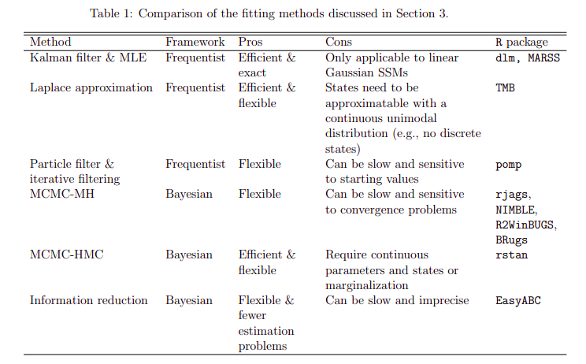

```{r setup, include = FALSE}
knitr::opts_chunk$set(cache = FALSE, 
                      #echo = FALSE, 
                      #message = FALSE, 
                      #warning = FALSE,
                      #fig.height=6, 
                      #fig.width = 1.777777*6,
                      tidy = FALSE, 
                      comment = NA, 
                      highlight = TRUE, 
                      prompt = FALSE, 
                      crop = TRUE,
                      comment = ">",
                      collapse = TRUE)
library(knitr)
library(kableExtra)
library(xtable)
library(viridis)
options(stringsAsFactors=FALSE)
knit_hooks$set(no.main = function(before, options, envir) {
    if (before) par(mar = c(4.1, 4.1, 1.1, 1.1))  # smaller margin on top
})
#knitr::opts_chunk$set(echo = FALSE)
knitr::opts_knit$set(width = 60)
source("my_knitter.R")
#library(tidyverse)
#library(reshape2)
#theme_set(theme_light(base_size = 16))
make_latex_decorator <- function(output, otherwise) {
  function() {
      if (knitr:::is_latex_output()) output else otherwise
  }
}
insert_pause <- make_latex_decorator(". . .", "\n")
insert_slide_break <- make_latex_decorator("----", "\n")
insert_inc_bullet <- make_latex_decorator("> *", "*")
insert_html_math <- make_latex_decorator("", "$$")
```
<style>
p.caption {
  font-size: 0.6em;
}
</style>

## Fitting State Space Models

- We have discussed how to fit NDLMs, but what happens when we have models that are non-linear or non-Gaussian?

## Fitting State Space Models

- We have discussed how to fit NDLMs, but what happens when we have models that are non-linear or non-Gaussian?
- This brings us into a much broader topic - non-linear SSMs

## Fitting State Space Models

- We have discussed how to fit NDLMs, but what happens when we have models that are non-linear or non-Gaussian?
- This brings us into a much broader topic - non-linear SSMs
- We will discuss fitting non-linear SSMs in `JAGS`


## Fitting State Space Models

- We have discussed how to fit NDLMs, but what happens when we have models that are non-linear or non-Gaussian?
- This brings us into a much broader topic - non-linear SSMs
- We will discuss fitting non-linear SSMs in `JAGS`
- Motivate the use of other packages, like `nimbleSMC`

## Can We Still Use JAGS?

- JAGS _can_ fit non-linear SSMs

## Can We Still Use JAGS?

- JAGS _can_ fit non-linear SSMs
- There are (usually) no analytic full conditional distributions

## Can We Still Use JAGS?

- `JAGS` _can_ fit non-linear SSMs
- There are (usually) no analytic full conditional distributions
- This means that `JAGS` will just do a brute force MCMC-MH to estimate all the parameters and latent states

## Can We Still Use JAGS?

- `JAGS` _can_ fit non-linear SSMs
- There are (usually) no analytic full conditional distributions
- This means that `JAGS` will just do a brute force MCMC-MH to estimate all the parameters and latent states
- Brute force with `JAGS` works sometimes, but we will cover some alternative methods

## Non-linear SSM in JAGS

Recall the SSM from the first presentation,

\begin{center}
$\begin{aligned}
&x_t = \frac{x_{t-1}}{2} + 25 \frac{x_{t-1}}{1 + x_{t-1} ^2} + 8 \cos(1.2t) + \epsilon_{proc} \\
&y_t = \frac{x_{t}^2}{20} + \epsilon_{obs} \\
&\epsilon_{proc} \sim N(0, \phi), \epsilon_{obs} \sim N(0, \tau)
\end{aligned}$
\end{center}

## Non-linear SSM in JAGS

Recall the SSM from the first presentation,

\begin{center}
$\begin{aligned}
&x_t = \frac{x_{t-1}}{2} + 25 \frac{x_{t-1}}{1 + x_{t-1} ^2} + 8 \cos(1.2t) + \epsilon_{proc} \\
&y_t = \frac{x_{t}^2}{20} + \epsilon_{obs} \\
&\epsilon_{proc} \sim N(0, \phi), \epsilon_{obs} \sim N(0, \tau)
\end{aligned}$
\end{center}

This is a common test function in SSM literature (see _Andrieu, Doucet, and Holenstein_ for example) because it is a bit of a nightmare to fit. 

## Non-linear SSM in JAGS

Recall the SSM from the first presentation,

\begin{center}
$\begin{aligned}
&x_t = \frac{x_{t-1}}{2} + 25 \frac{x_{t-1}}{1 + x_{t-1} ^2} + 8 \cos(1.2t) + \epsilon_{proc} \\
&y_t = \frac{x_{t}^2}{20} + \epsilon_{obs} \\
&\epsilon_{proc} \sim N(0, \phi), \epsilon_{obs} \sim N(0, \tau)
\end{aligned}$
\end{center}

This is a common test function in SSM literature (see _Andrieu, Doucet, and Holenstein_ for example) because it is a bit of a nightmare to fit. 

Let's fit this model in `JAGS`

## Non-linear SSM in JAGS
\footnotesize
```{r}
library(rjags)
library(coda)
set.seed(50)
## set parameters
t <- 15
x <- rep(NA, t)
phi <- 1
tau <- 4
x[1] <- 10
## generate data
for (i in 2:t){
  x[i] <- rnorm(1, .5*x[i-1] + 25*(x[i-1]) / (1 + x[i-1]^2) 
                + 8*cos(1.2*i), sd = 1/sqrt(phi))
}
y <- .05*x^2 + rnorm(t, 0, 1/sqrt(tau))

```

## Non-linear SSM in JAGS

```{r, echo = FALSE}
plot(x, type = 'l', ylim = c(-20,35), pch = 3, lwd = 2, xlab = 'Time', ylab = 'X', col = 'blue')
points(y, pch = 3, lwd = 3, col = 'red')
legend('topleft', legend = c('Latent States', 'Observations'), col = c('blue', 'red'), lwd = c(2, 2), lty = c(1, NA), pch = c(NA, 3))
```

## Non-linear SSM in JAGS
\small
```{r, eval = FALSE}
## sink the JAGS model
sink('jags_test_ex2.bug')
cat('model {
  for(i in 2:nday){
    x.pred[i] = .5*x[i-1] + 25*(x[i-1]) / (1 + x[i-1]^2) 
      + 8*cos(1.2*i)
    x[i] ~ dnorm(x.pred[i], phi)
  }
  for(i in 1:nday){
    y[i] ~ dnorm(.05*x[i]^2, tau)
  }
  ## Initial conditions
  x[1] ~ dnorm(10, .5)
  
  ## Priors on process errors
  phi ~ dnorm(0, .01)T(0,100)
}'
)
sink()
```

## Non-linear SSMs in JAGS
\small
```{r, message = FALSE, results = 'hide'}
## make list of model data
model_data <- list('nday' = t,
                   'y' = y,
                   'tau' = tau)
## compile model
jags_ex2 <- jags.model('jags_test_ex2.bug',
                       data = model_data,
                       n.chains=1,
                       n.adapt=1000)
## generate samples
samples_ex1 = coda.samples(model = jags_ex2,
                           variable.names = 
                           c('phi', paste0(paste0('x[', 1:t), ']')),
                           n.iter = 20000)

```

## Non-linear SSMs in JAGS

```{r, echo = FALSE}
means <- rep(NA, t)
lcb <- rep(NA, t)
ucb <- rep(NA, t)
mat_samps <- as.matrix(samples_ex1)
for (i in 1:t){
  ind <- which(colnames(mat_samps) == paste0(paste0('x[', i),']'))
  means[i] <- mean(mat_samps[,ind])
  lcb[i] <- quantile(mat_samps[,ind], probs = .025)
  ucb[i] <- quantile(mat_samps[,ind], probs = .975)
}
par(mfrow = c(1,1))
plot(means, type = 'l', col = 'red', ylim = c(-20, 20), lwd = 2)
points(lcb, type = 'l', col = 'red', lty = 2, lwd = 2)
points(ucb, type = 'l', col = 'red', lty = 2, lwd = 2)
points(x, col = 'blue', pch = 3, lwd = 2)
legend('bottomleft', legend = c('True States', 'Posterior Mean', 'Credible Bounds'), 
       lty = c(1, 1, 2), col = c('blue', 'red', 'red'))
```

## Non-linear SSMs in JAGS
- We see that a few of our latent states estimates were quite far from the truth

## Non-linear SSMs in JAGS
- We see that a few of our latent states estimates were quite far from the truth
- The MCMC is having difficulty determining the sign of the latent states

## Non-linear SSMs in JAGS
- We see that a few of our latent states estimates were quite far from the truth
- The MCMC is having difficulty determining the sign of the latent states
- MCMC-MH can have trouble exploring the entire parameter space for the latent states


## Non-linear SSMs in JAGS
- We see that a few of our latent states estimates were quite far from the truth
- The MCMC is having difficulty determining the sign of the latent states
- MCMC-MH can have trouble exploring the entire parameter space for the latent states
- One method of more efficiently generating samples for SSMs is a _particle filter_

## Particle Filtering

## Particle Filtering

- Particle filters are a Monte Carlo method used to estimate the states in dynamic models

## Particle Filtering

- Particle filters are a Monte Carlo method used to estimate the states in dynamic models
- They use a set of samples (called _particles_) drawn from the initial conditions


## Particle Filtering

- Particle filters are a Monte Carlo method used to estimate the states in dynamic models
- They use a set of samples (called _particles_) drawn from the initial conditions
- These particles are evolved using the evolution function $f(x_t | x_{t-1}, \Theta)$


## Particle Filtering

- Particle filters are a Monte Carlo method used to estimate the states in dynamic models
- They use a set of samples (called _particles_) drawn from the initial conditions
- These particles are evolved using the evolution function $f(x_t | x_{t-1}, \Theta)$
- When observations are available, these particles get weights assigned and are resampled

## Particle Filtering

- Particle filters are a Monte Carlo method used to estimate the states in dynamic models
- They use a set of samples (called _particles_) drawn from the initial conditions
- These particles are evolved using the evolution function $f(x_t | x_{t-1}, \Theta)$
- When observations are available, these particles get weights assigned and are resampled
- This generates approximations to the latent states

## The Bootstrap Filter

## The Bootstrap Filter
- One of the most common particle filters is the Bootstrap filter

## The Bootstrap Filter
- One of the most common particle filters is the Bootstrap filter
- It has an easy interpretation 

## The Bootstrap Filter
- One of the most common particle filters is the Bootstrap filter
- It has an easy interpretation 
- Relatively easy to implement

## The Bootstrap Filter Algorithm

Step 1: Generate a set of particles by sampling from the initial conditions

```{r, echo = FALSE}
x <- rnorm(25, 10, .5)
x2 <- rnorm(25, .9*x + .1, 1)
ind <- c(1,2)
plot(seq(from = 8, to = 12, length.out = 1000), dnorm(seq(from = 8, to = 12, length.out = 1000), 10, .5), type = 'l',
     xlab = 'x', ylab = 'density')
points(x, rep(0, 25), pch = 2, col = 'blue')
```

## The Bootstrap Filter Algorithm

Step 2: Evolve the particles to the next timestep using $f(x_t | x_{t-1}, \Theta)$

```{r, echo = FALSE}
plot(c(x[1], x2[1]), xlim = c(0.5, 2.5), ylim = c(5,15), type = 'l', col = 'blue', pch = 2, lwd = 2,
     xlab = 'Time', ylab = 'x')
points(c(x[1], x2[1]), pch = 2, col = 'blue')
for (i in 2:25){
  points(c(x[i], x2[i]), type = 'l', col = 'blue', pch = 5, lwd = 1)
  points(c(x[i], x2[i]), col = 'blue', pch = 5, lwd = 1)
}
```


## The Bootstrap Filter Algorithm

Step 3: Generate weights for the particles using $g(y_t | x_t, \Theta)$

```{r, echo = FALSE}
plot(seq(from = 8, to = 12, length.out = 1000), dnorm(seq(from = 8, to = 12, length.out = 1000), 9.5, .5), type = 'l',
     xlab = 'x', ylab = 'density')
points(x2, rep(0, 25), pch = 2, col = 'blue')
```

## The Bootstrap Filter Algorithm

Step 4: Resample the particles using the weights from Step 3 with replacement (a la Bootstrapping)

```{r, echo = FALSE}
weights <- dnorm(x2, 9.5, .5)
x2_new <- sample(x2, size = length(x2), prob = weights / sum(weights), replace = TRUE)
plot(seq(from = 8, to = 12, length.out = 1000), dnorm(seq(from = 8, to = 12, length.out = 1000), 9.5, .5), type = 'l',
     xlab = 'x', ylab = 'density')
points(x2_new, rep(0, 25), pch = 2, col = 'blue')
```


## The Bootstrap Filter Algorithm

Step 5: Repeat this process for the next timestep, using the bootstrap samples as the new set of particles

## Cons of Particle Filtering

## Cons of Particle Filtering
- Generally, larger numbers of particles lead to better approximations

## Cons of Particle Filtering
- Generally, larger numbers of particles lead to better approximations
- Large numbers of particles lead to a large increase in computation time

## Cons of Particle Filtering
- Generally, larger numbers of particles lead to better approximations
- Large numbers of particles lead to a large increase in computation time
- While the bootstrap filter is easy to implement, it can be difficult to implement effectively and quickly

## NIMBLE

- `NIMBLE` is an `R` package that extends the `JAGS`/`BUGS` language


## NIMBLE

- `NIMBLE` is an `R` package that extends the `JAGS`/`BUGS` language
- `NIMBLE` also uses a symbolic language to make coding of models easier, and converts it to `C++` code 

## NIMBLE

- `NIMBLE` is an `R` package that extends the `JAGS`/`BUGS` language
- `NIMBLE` also uses a symbolic language to make coding of models easier, and converts it to `C++` code 
- Can use methods other than MCMC-MH for sampling, including particle filters

## Non-linear SSMs in NIMBLE

`NIMBLE` models are generated similarly to how they are in `JAGS`
\small
```{r, results = 'hide', message = FALSE}
library(nimble, quietly = TRUE)
library(nimbleSMC, quietly = TRUE)
nimble_ssm <- nimbleCode({
  ## initial conditions
  x[1] ~ dnorm(10, tau = .5)
  ## phi prior
  phi ~ dexp(scale = 10)
  ## latent process
  for(i in 2:nday){
    x[i] ~ dnorm(.5*x[i-1] + 25* (x[i-1] / (1 + x[i-1]^2)) 
                 + 8*cos(1.2*i), tau = phi)
  }
  ## observation model
  for(i in 1:nday){
    y[i] ~ dnorm(.05*x[i]^2, tau = tau)
  }
})
```

## Non-linear SSMs in NIMBLE
\footnotesize
```{r, results = 'hide', message = FALSE}
## make data list
data <- list(y = y)
## set model constants
constants <- list(nday = 15, tau = tau)
## set starting values
inits <- list(
  phi = 1,
  x = sqrt(20*abs(y))
)
## compile model
stateSpaceModel <- nimbleModel(nimble_ssm,
                               data = data,
                               constants = constants,
                               inits = inits,
                               check = FALSE)
```

## Non-linear SSMs in NIMBLE
\footnotesize
```{r, , results = 'hide', message = FALSE}
## add bootstrap filter for latent states
bootstrapFilter <- buildBootstrapFilter(stateSpaceModel, nodes = 'x')
## compile model to add bootstrap filter
compiledList <- compileNimble(stateSpaceModel, bootstrapFilter)

stateSpaceMCMCconf <- configureMCMC(stateSpaceModel, nodes = NULL)

## add a random walk sampler for phi
stateSpaceMCMCconf$addSampler(target = 'phi',
                            type = 'RW_PF', 
                            control = list(latents = 'x'))
## re-compile to add phi sampler
stateSpaceMCMC <- buildMCMC(stateSpaceMCMCconf)
compiledList <- compileNimble(stateSpaceModel, 
                              stateSpaceMCMC, 
                              resetFunctions = TRUE)
## generate samples
compiledList$stateSpaceMCMC$run(10000)
```

## Comparison

```{r, echo = FALSE}
set.seed(50)
t <- 15
x <- rep(NA, t)
phi <- 1
tau <- 4
x[1] <- 10

for (i in 2:t){
  x[i] <- rnorm(1, .5*x[i-1] + 25*(x[i-1]) / (1 + x[i-1]^2) + 8*cos(1.2*i), sd = 1/sqrt(phi))
}
y <- .05*x^2 + rnorm(t, 0, 1/sqrt(tau))
library(matrixStats)
library(coda)
posteriorSamps <- as.mcmc(as.matrix(compiledList$stateSpaceMCMC$mvSamples))
par(mfrow = c(1,1))
plot(means, type = 'l', col = 'red', ylim = c(-20, 20), lwd = 2)
points(lcb, type = 'l', col = 'red', lty = 2, lwd = 2)
points(ucb, type = 'l', col = 'red', lty = 2, lwd = 2)
points(x, pch = 3, lwd = 2)
points(colMeans(posteriorSamps[2000:10000,2:16]), col = 'blue', type = 'l', lwd = 2)
points(colQuantiles(posteriorSamps[2000:10000,2:16], prob = .975), col = 'blue', type = 'l', lwd = 2, lty = 2)
points(colQuantiles(posteriorSamps[2000:10000,2:16], prob = .025), col = 'blue', type = 'l', lwd = 2, lty = 2)
legend('bottomleft', legend = c('True States', 'JAGS Mean', 'JAGS Credible', 'NIMBLE Mean', 'NIMBLE Credible'), 
       lty = c(1, 1, 2, 1, 2), col = c('black', 'red', 'red', 'blue', 'blue'))
```

## Review

In this training session, we have covered:

- What is a State Space model?


## Review

In this training session, we have covered:

- What is a State Space model?
- Why would you want to use State Space models?

## Review

In this training session, we have covered:

- What is a State Space model?
- Why would you want to use State Space models?
- NDLM estimation theory

## Review

In this training session, we have covered:

- What is a State Space model?
- Why would you want to use State Space models?
- NDLM estimation theory
- How to fit, assess, and forecast using `JAGS`

## Review

In this training session, we have covered:

- What is a State Space model?
- Why would you want to use State Space models?
- NDLM estimation theory
- How to fit, assess, and forecast using `JAGS`
- Background for particle filters

## Review

In this training session, we have covered:

- What is a State Space model?
- Why would you want to use State Space models?
- NDLM estimation theory
- How to fit, assess, and forecast using `JAGS`
- Background for particle filters
- How to use particle methods in `NIMBLE`

## What Else?

There are still a lot of things we didn't have time to cover about SSMs. For those interested in learning more, I suggest reading _An introduction to state-space modeling of ecological time series_ by Auger-Methe et al, 2020.

## Other Options for Fitting



## Thank You Everyone!


